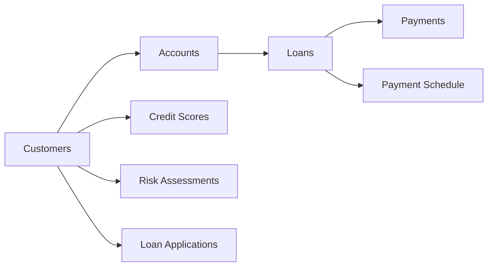

# Credit Risk Management Database

**Synthetic credit-risk data engineering in SQL: grain contracts, fan-out prevention, reconciliation gates, deterministic latest-state logic, and executable CI.**

This clean-room portfolio project uses only simulated data and generic banking concepts. It contains no employer/customer data, internal schemas, or production policy logic.

## What this project is designed to show

- relational schema design for credit-risk-style data,
- explicit analytical grain,
- deterministic latest-record logic,
- pre-aggregation before one-to-many joins,
- duplicate / fan-out prevention,
- customer- and loan-level risk reporting,
- reconciliation and source-quality controls,
- executable SQL validation through CI.

## Data model



## Analytical principle

A direct join from `Loans` to both `Payments` and `Payment_Schedule` can multiply rows and overstate monetary totals.

The engineered queries therefore follow this pattern:

```text
source tables
    ↓
deduplicate / select latest record
    ↓
aggregate one-to-many child tables
    ↓
join at the intended customer or loan grain
    ↓
reconcile row counts / keys
    ↓
produce analytical output
```

## Repository structure

| File | Purpose |
| --- | --- |
| `database.sql` | schema plus simulated seed data |
| `sample_queries.sql` | grain-controlled analytical queries |
| `data_quality_checks.sql` | canonical data-quality and reconciliation release gates |
| `archive/legacy_data_cleaning_exploration.sql` | retained legacy predecessor; excluded from the active execution path |
| `docs/DATA_CONTRACT.md` | explicit source grains, keys, join rules and release conditions |
| `docs/ARCHITECTURE.md` | risk-data engineering flow and design rationale |
| `docs/RECONCILIATION.md` | hard/soft reconciliation standards |
| `.github/workflows/sql-ci.yml` | executable SQLite smoke test |
| `PUBLIC_DATA_BOUNDARY.md` | hard clean-room / confidentiality rules |
| `CHANGELOG.md` | material engineering and schema fixes |

## Engineering controls

The SQL includes:

- `ROW_NUMBER()` for deterministic latest-record selection,
- payment and schedule aggregation before loan joins,
- customer-level aggregation before risk reporting,
- duplicate-key diagnostics,
- orphan / referential-integrity checks,
- amount and date quality controls,
- loan-grain release gates,
- explicit diagnostic columns instead of `SELECT *`.

## Example analytical outputs

The repository includes queries for:

- loan-level payment performance,
- customer-level delinquency,
- active exposure by risk level,
- latest credit-score and risk-assessment state,
- chronological credit-score movement,
- application funnel analysis,
- multiple-active-loan detection,
- source and output reconciliation.

## Data contract and reconciliation

The project now declares its source grains and join rules explicitly in [the data contract](docs/DATA_CONTRACT.md). The [reconciliation standard](docs/RECONCILIATION.md) separates hard release gates from soft portfolio reconciliations.

## Data quality

The CI workflow executes the database end-to-end in SQLite:

1. build schema and seed data,
2. execute `data_quality_checks.sql`,
3. execute the engineered analytical queries.

The CI work already exposed and led to fixes for historical schema/seed mismatches such as `DaysLate`, `RequestedAmount`, and `ScoreDate / CreditScore`.

## Tech stack

- SQL
- SQLite-compatible analytical SQL
- window functions
- relational modeling
- GitHub Actions CI

## Confidentiality boundary

This repository was built as a clean-room public project. It does not use or reproduce employer data, employer code, internal table/column names, customer records, internal model parameters, or proprietary banking workflows.

## Limitations

- simulated dataset designed for portfolio demonstration; customer identity fields use unmistakably fictional placeholders,
- not a production underwriting database,
- no real customer or employer data,
- limited scale relative to a banking production environment,
- business rules are illustrative rather than regulatory policy.

## Related browser case study

The Data Observatory portfolio includes an interactive browser companion that demonstrates grain-safe SQL patterns visually.

**[Open the Credit Risk browser demo](https://mrwanahmedx.github.io/data-observatory/risk.html)**  
**[View Data Observatory source](https://github.com/mrwanahmedx/data-observatory)**

## Change history

See [CHANGELOG.md](./CHANGELOG.md) for the schema fixes and SQL-engineering pass.

## Author

**Marwan Ahmed**  
[LinkedIn](https://www.linkedin.com/in/mrwan-ahmed/) · [GitHub](https://github.com/mrwanahmedx)
