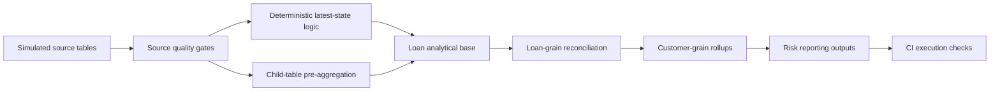

# Architecture

## Design goal

The project demonstrates a small but realistic risk-data engineering principle: **analytical correctness begins with grain control**.

The most important failure mode addressed here is fan-out. If a loan is joined directly to multiple payment rows and multiple repayment-schedule rows, monetary values can be duplicated. The project therefore reduces each child source independently before it is joined into a loan- or customer-level analytical base.

## Separation of concerns

- `database.sql` — schema + simulated seed data.
- `data_quality_checks.sql` — source-quality and reconciliation gates.
- `sample_queries.sql` — analytical marts/reports with explicit grain.
- `.github/workflows/sql-ci.yml` — reproducible execution gate.
- `docs/` — data contract and architecture.

The project deliberately avoids production-bank naming, internal policy logic, and employer-derived schemas.
